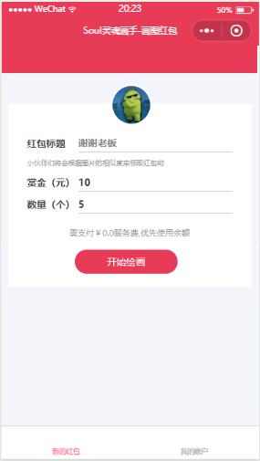
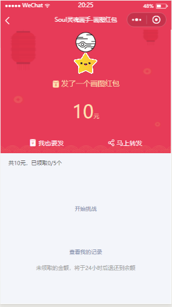
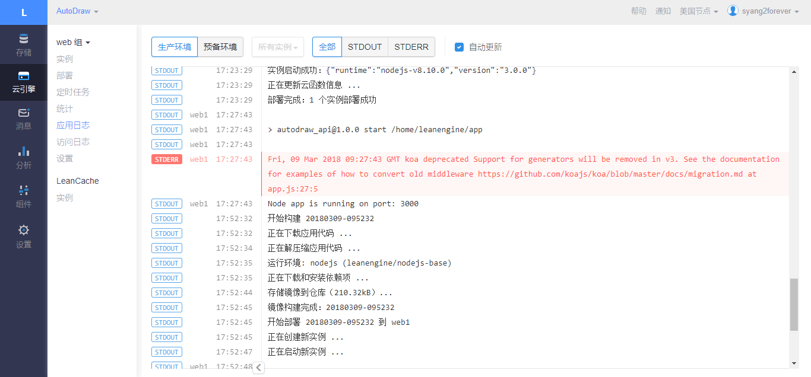
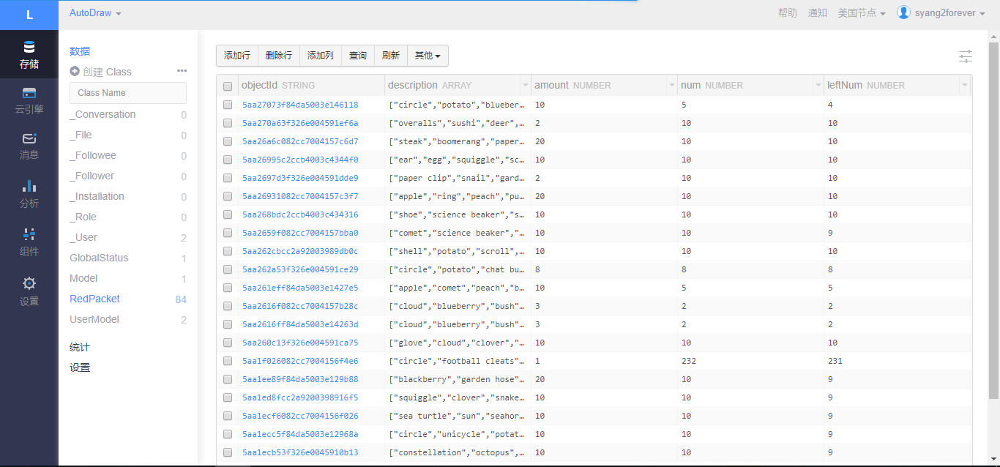

# 开发文档

## 背景分析

当前市场上，有着许多的抢红包小程序，这些程序的推出，在大家的票圈形成了小程序的新风潮。在小程序风靡与各商户的基础点单和信息介绍功能后，它的娱乐功能也引起了大家的关注，从跳一跳等小游戏，到各式的占卜、翻拍红包。我们可以发现大家其实需要这样简单，有意思且易用的小程序。来消弭人与人之间的距离。花费较小的金额，就可以与不常联系的大家进行更多活动。

## 可行性分析

小程序的文档虽然不够完善，但是类似 `soul画师` 这样的抢红包小程序并不需要太过复杂的架构。本次程序的实践难点是程序的数据集，幸好 google 提供了足够的资源，保证算法在识别简笔画后，可以生成对应的图形。

## 前端

我们选择采用微信的小程序作为前端界面

### 原因

由上述背景原因和可行性分析我们可以发现，小程序是最适合我们开发的前端界面，而且小程序具有开发快速、易于推广等特点

### 小程序代码结构

* `lib`
  * `av-weapp-min.js` leancloud sdk
* `pages`
  * `index` 红包的主页面，可以自定义
  * `draw` 用户在画板上参与画画
  * `packet` 生成以后的红包页面
  * `compete` 参与者根据给定的画开始绘画
  * `mine` 个人的画画记录
* `app.js` 小程序主程序
* `app.json` 小程序配置文件
* `app.wxss` 小程序样式文件
* `config.js` 项目配置文件

### 界面

首页：



绘图：


红包：



### 运行流程

1. 用户登录并选择红包金额和数目
2. 用户简笔画出自己想要的图形
3. 机器生成推荐图案并由用户选择
4. 用户选择指定图案后生成红包
5. 其它用户通过分享的链接参与抢红包获得
6. 其它用户根据红包提示进行绘画
7. 机器进行相似度匹配，得分越高者有较大几率获得高额红包
8. 或者其它用户也可以选择自己去发红包

## 后端

### 平台

在后端平台的，我们选择国内领先的 BaaS 提供商 `LeanCloud`，为我们的移动端开发提供强有力的后端支持。

### 原因

微信小程序对请求链接限定为 `https`，而一般域名默认都是 `http`，这意味着如果采用自己的 `云主机` + `服务` 的话，需要额外配置域名并采用 `https`，极大地增加了非开发上的技术成本。而采用 `LeanCloud` 作为后端服务商，我们只需要将服务部署到这一平台，确保后端服务的稳健运行即可，`LeanCloud` 替我们很好地解决了域名等非开发上的技术成本。

同时，`LeanCloud` 替我们封装了后台储存上的实现，使得我们可以忽略数据库上的结构设计，更快地将精力投入到程序的具体开发过程中。

### 后端项目结构

* `.leancloud` leancloud 配置文件夹
* `public` 生成文件夹
* `routes` 路由文件夹
* `views` 视图文件夹
* `.gitignore` git 配置文件
* `.leanignore` leancloud 项目配置文件
* `app.js` 程序定义文件
* `cloud.js` 云服务定义文件
* `package.json` nodejs 项目配置文件
* `package-lock.json` nodejs 项目配置文件
* `server.js` 主程序

### 核心实现

项目的核心在于 `LeanCloud` 的提供的云函数功能，我们通过定义云函数并负责实现的方式，由 `LeanCloud` 负责相应的请求配置与转发

服务器定义代码：

```JavaScript
AV.Cloud.define('newRedPacket', async (request) => {
    let { u_id, avatar, username, amount, num, src, title, description } = request.params;
    let user;
    amount = parseInt(amount);
    num = parseInt(num);
    try {
        user = await findUser(u_id);
        modifyAmount(user, -amount, true);
    } catch (err) {
        throw err;
    }
    const p_id = await fetchGlobalStatus();
    const RedPacket = AV.Object.extend('RedPacket');
    const packet = new RedPacket();
    ... // 省略部分代码
    user.add('sp_ids', p_id);
    user.increment('sAmount', amount);
    user.increment('sNum', 1);
    await Promise.all([
        packet.save(),
        user.save()
    ]);
    return p_id;
});
```

小程序调用代码：

```JavaScript
Cloud.run('newRedPacket', options).then((response)=>{
  const p_id = response;
  wx.navigateTo({
    url: `../packet/packet?p_id=${p_id}`
  });
});
```

### 运行环境

后端运行环境：



后端数据存储：


